# Manga Quiz!
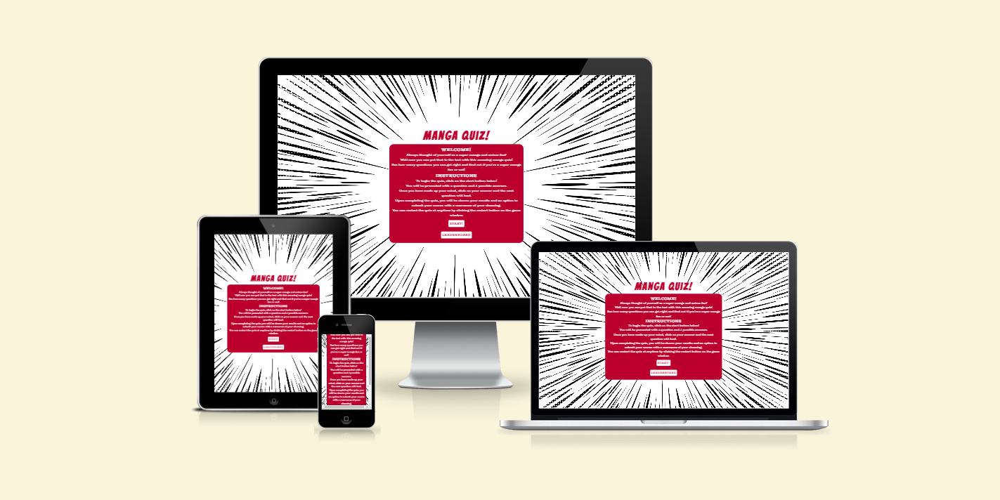

## Introduction

The manga quiz is a web based quiz game which tests users on their knowledge of Japanese anime and manga. The game is for fans of Japanese anime and manga, who want to see how big of a fan they actually are and maybe learn a few new facts along the way.

## UX

### User Goals
* Simple and easy to play.
* Fun and interesting quiz.
* Aesthetically pleasing design.
* Leaderboard of high scores.

### User Stories
* As a user, I want the quiz to be simple and easy to understand.
* As a user, I want the quiz to be fun and interesting.
* As a user, I want the site to have an interesting and captivating design.
* As a user, I want to find a leaderboard of current high scores.
* As a user, I want to test my knowledge of manga and learn interesting facts.

### Site Goals
* To create a quiz which is fun and interesting for users.
* To create an aesthetically pleasing quiz to captivate potential users.
* To create content which is entertaining to engage user.
* To make the quiz accessible to all potential users.

### Requirements
* Easy to play quiz.
* Aesthetically pleasing design.
* Interesting and entertaining content.
* Accessible to all potential users
* Leaderboard for high scores.

## Design Choices

### Fonts

[Google Fonts](https://fonts.google.com/ "Google Fonts") has been used to find a font for the main logo for the quiz which fits the overall theme and aesthetic. The font selected for the main logo is [Bangers](https://fonts.google.com/specimen/Bangers "Bangers") as it perfectly encapsulates the theme of Japanese anime and manga with it's comic book feel. [Fontjoy](https://fontjoy.com/ "Fontjoy") was then used to find a font to compliment [Bangers](https://fonts.google.com/specimen/Bangers "Bangers") to be used in the main body of the quiz. [BioRhyme](https://fonts.google.com/specimen/BioRhyme "BioRhyme") was selected from the [Fontjoy](https://fontjoy.com/ "Fontjoy") results as it was found to compliment the logo font well and also matches the theme of the quiz.

### Background Image

The background image was found on [freepik](https://www.freepik.com/ "freepik") and is of a zoom effect which you would find in a manga comic panel. This image not only fits the general theme of the quiz but creates a focus on centre of the screen where the quiz will be placed.

### Colours

Two colours which were preselected are the colours found in the Japanese flag. These are the colours of crimson and white. [Coolors](http://coolors.co "Coolors") was then used to lock in these 2 preselected colours and create a palette to be used for the quiz.

The colours and their uses are listed below.

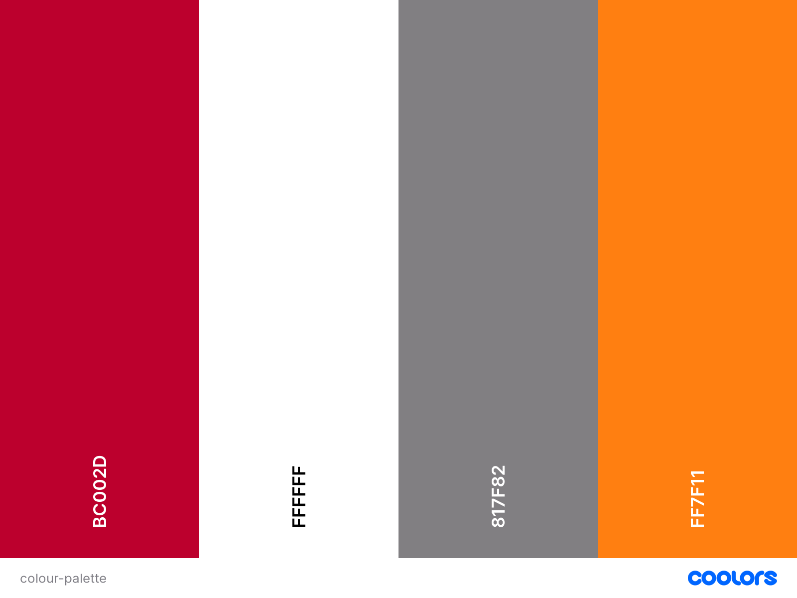

* #BC002D - This colour is used for each window, main logo and some text.
* #FFFFFF - This colour is used for text and background colour for containers.
* #818F82 - This colour is used for box shadow on buttons when active.
* #FF7F11 - This colour is used for box shadow on button hover, prefix background and input text.
* #1AFF00 - This colour is used to highlight the option container when the correct answer is selected.
* #FF1515 - This colour is used to highlight the option container when the incorrect answer is selected.

### Structure

The structure of the site and quiz will be one of simplicity as to not deter the user from engaging with the content. On loading, the intitial content will be of a window containing a welcome message and instructions on how to progress through the quiz. The window will also contain a button to begin the quiz and one to access the leaderboard. 

Once the start button is clicked, the welcome window will no longer be displayed and will be replaced by the quiz window. Once the quiz is complete, a result window will replace the quiz window with a form to submit the score to the leaderboard. The result window will include a navigation button to return back to the welcome page.

The leaderboard can be accessed via the welcome window and will include a close button to hide leaderboard and replace with welcome window again.

## Wireframes

Wireframes have been created using [Balsamic](https://balsamiq.com "Balsamic"). These wireframes give a basic view of how the quiz will be laid out and structured. 

### Welcome Window
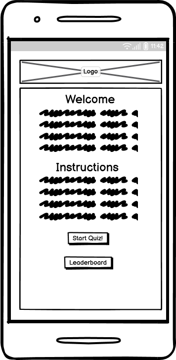 
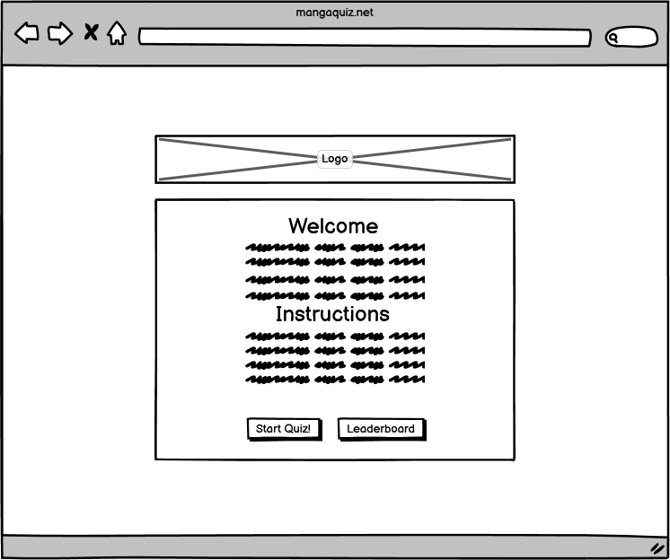

### Game Window
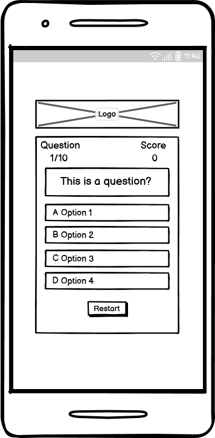 
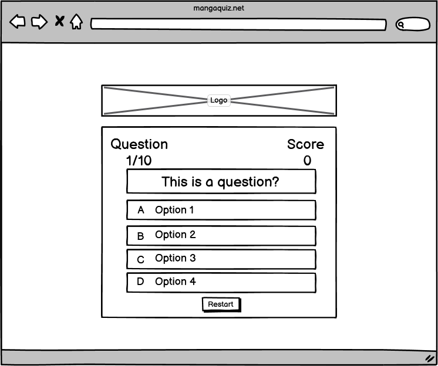

### Result Window
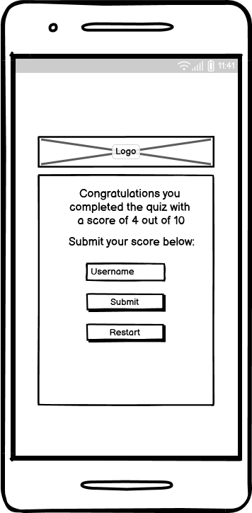 
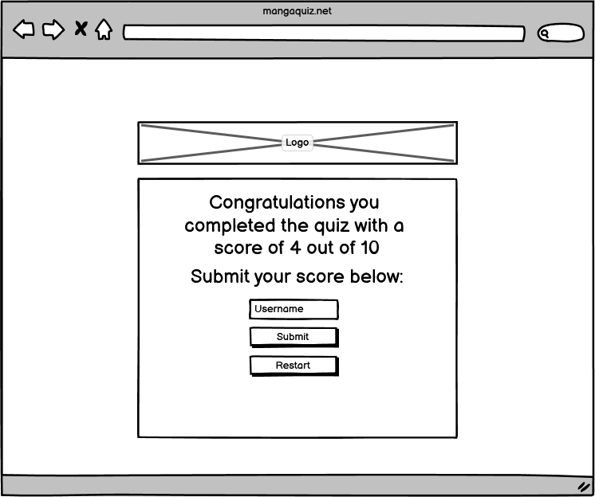

### Leaderboard Window
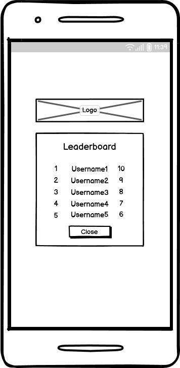 

## Features

### Logo

The logo will is styled using the [Bangers](https://fonts.google.com/specimen/Bangers "Bangers") font and acts to immediately engage the user.

### Welcome Window

The welcome window will give a brief welcome message to the user and instructions on how to progress through the quiz. There is also a button to start the quiz and one to access the leaderboard.

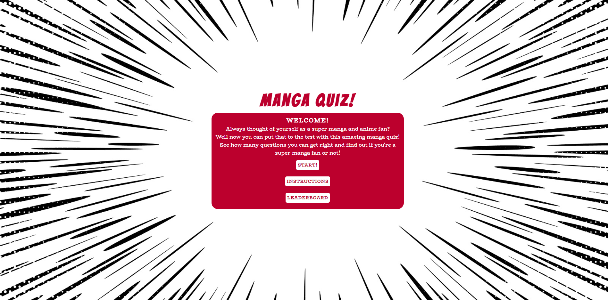

### Game Window

The game window will show the question counter and their current score at the top. Underneath will be the current question, followed by the 4 possible answers. Once the answer has been selected, the next question will be loaded, the question counter and current score (if necessary) will be updated. There will be a restart button underneath the answers to allow the user to start the quiz again, if they so wish.

When the correct answer is selected, the background for the option container will change to green and red when the incorrect answer is selected.

### Result Window

The result window will show a congratulation, or commiseration message depending on the score the user achieved. The message will include the users score. There will be an input field for the user to add their username, along with a button to submit their score and if it is good enough, their score will be added to the leaderboard. A button to take the user back to the welcome window will be placed at the bottom. 

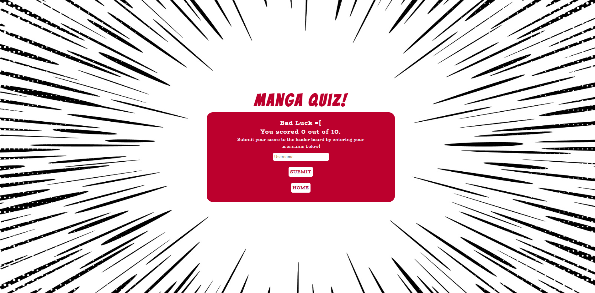

### Leaderboard Window

The leaderboard window can be accessed via a button on the welcome window. This will show the best 5 scores for the quiz. It will feature the username, score and position on the leaderboard for the user.

## Testing

## Technologies Used

### Languages

* [HTML](https://en.wikipedia.org/wiki/HTML "HTML")
* [CSS](https://en.wikipedia.org/wiki/CSS "CSS")
* [JavaScript](https://en.wikipedia.org/wiki/JavaScript "JavaScript")

### Libraries & Framework

* [Google Fonts](https://fonts.google.com "Google Fonts")

### Tools

* [GitHub](https://github.com "GitHub")
* [Gitpod](https://gitpod.io "Gitpod")
* [Balsamic](https://balsamiq.com "Balsamic")
* [Coolors](http://coolors.co "Coolors")
* [DevTools](https://developer.chrome.com/docs/devtools "DevTools")
* [W3C Markup Validation](https://validator.w3.org/#validate_by_input "W3C Markup Validation")
* [W3C CSS Validation](https://jigsaw.w3.org/css-validator/#validate_by_input "W3C CSS Validation")
* [WAVE Web Accessibility Evaluation Tool](https://wave.webaim.org/ "WAVE Web Accessibility Evaluation Tool")

## Deployment

The site was deployed using GitHub. The steps for deployment are as follows:

1. Navigate to repository for GitHub project.
2. Navigate to settings tab.
3. Navigate to page settings under **Code and automation**.
4. Under **Build and deployment** select **Deploy from branch** as source.
5. Ensure the main branch is selected and click save.
6. After these steps have been completed, the page should go live within a few minutes.
7. Your live project will be viewable from http://**your-username**.github.io/**your-project-title**/

## Credits

I would like to thank my mentor [Simen Daehlin](https://github.com/Eventyret "Simen Daehlin") for all his advice. For pushing me to learn new things and think outside the box.

I would also like to thank my friend [Marco](https://github.com/marconett "Marco") for all the help he gave me in troubleshooting issues with my project and his patience in helping me understand what I was doing.